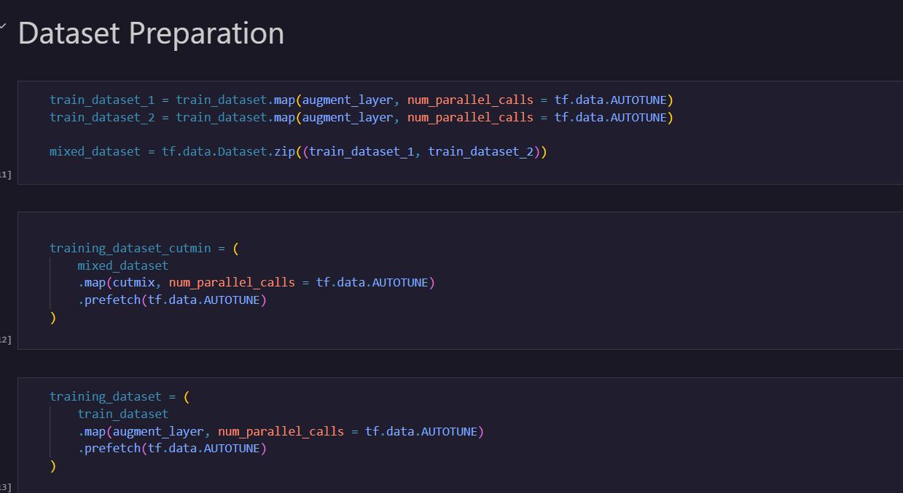
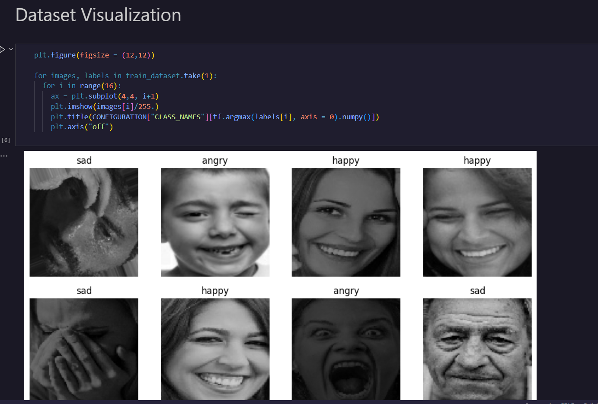
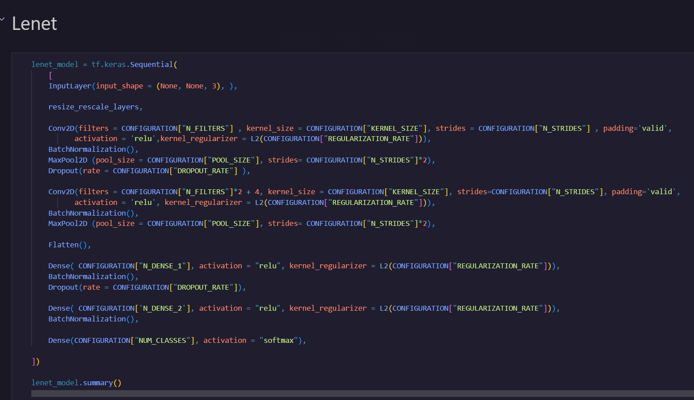
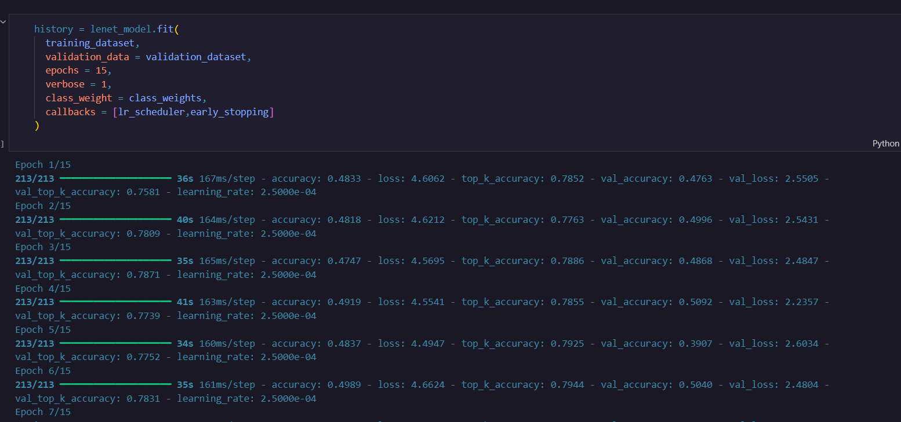
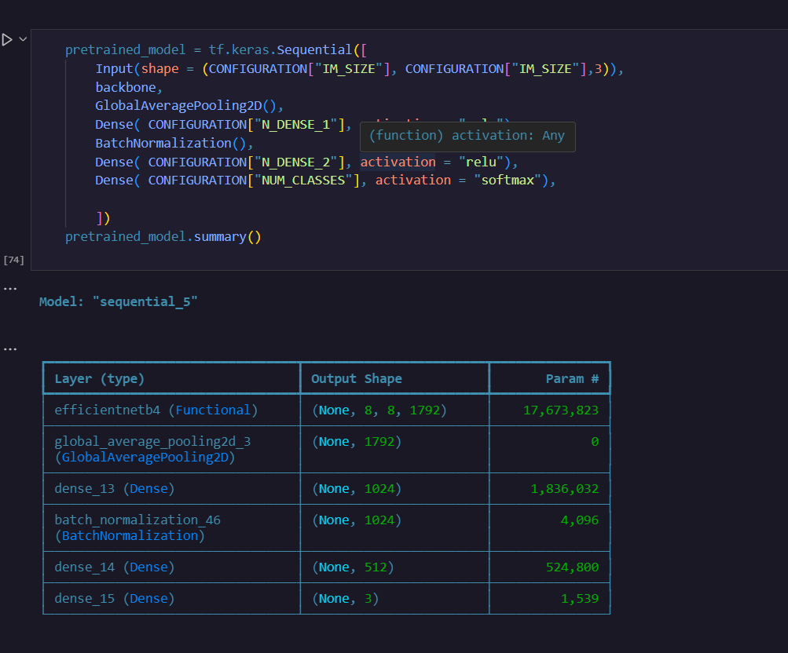
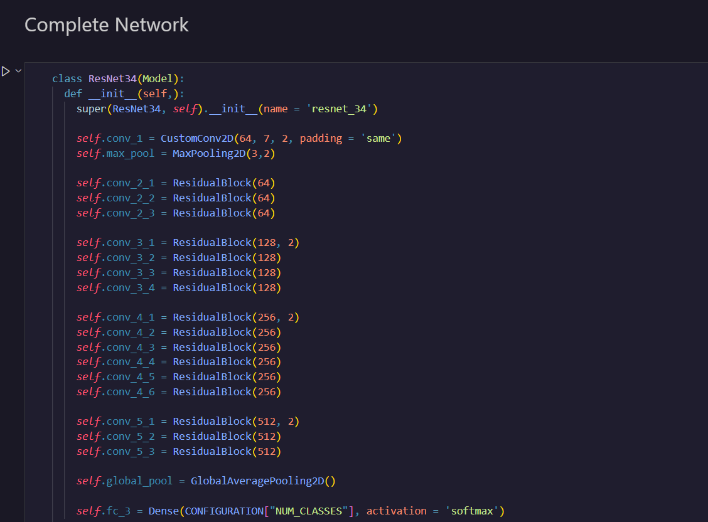
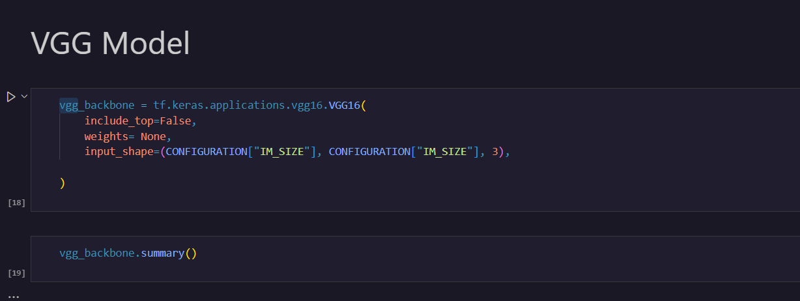
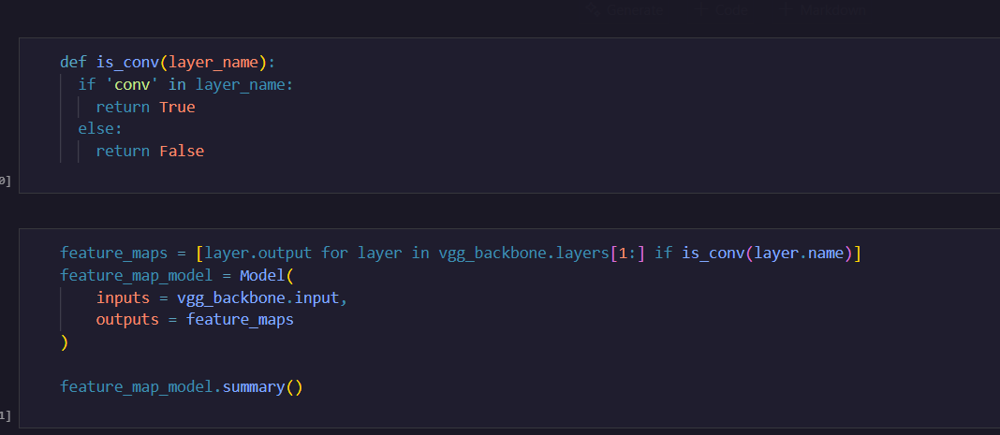
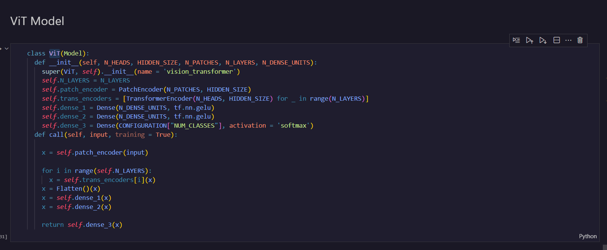
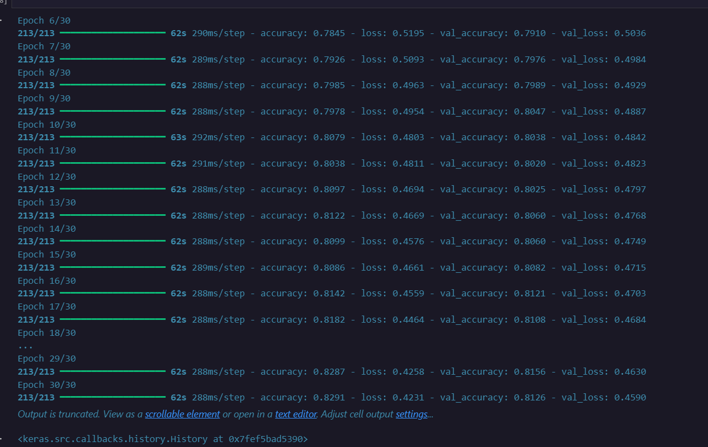

# README: Emotion Detection Project

---

# Table of Sections

| **Section** | **Description**                            |
|-------------|--------------------------------------------|
| 2           | Project Configuration                      |
| 3           | Dataset Loading and Preprocessing          |
| 4           | Dataset Visualization                      |
| 5           | Model Architectures Overview               |
| 6           | LeNet Model                                |
| 7           | Pretrained Model 1 (MobileNetV2)           |
| 8           | Pretrained Model 2 (ResNet50)              |
| 9           | VGG-like Model                             |
| 10          | Custom Classification Head                 |
| 11          | Grad-CAM Model for Explainability          |
| 12          | Vision Transformer (ViT) Model             |
| 13          | Model Training and Evaluation              |
| 14          | Inference and Predictions                  |
| 15          | Prediction Analysis and Results            |
| 16          | Model Statistics and Comparison            |
| 17          | Conclusion and Future Work                 |

---
# Section 1: Introduction

## 1.1 Project Overview
The primary objective of this project is to detect human emotions from facial images using deep learning models. We implement a diverse set of models, including CNN-based architectures, Vision Transformers (ViT), and explainability models such as Grad-CAM. The project focuses on achieving high accuracy while maintaining model interpretability.

## 1.2 Expected Outcomes
- **High Accuracy:** Achieving robust emotion classification.
- **Model Interpretability:** Visualizing model decisions using explainability techniques.
- **Scalability:** Deploying a model-ready system suitable for real-world environments.

## 1.3 Technology Stack
- **Frameworks:** TensorFlow, Keras
- **Data Processing:** NumPy, Pandas
- **Visualization:** Matplotlib, Seaborn
- **Pretrained Models:** MobileNetV2, ResNet50, Vision Transformer (ViT)
- **Development Environment:** Jupyter Notebook
- **Deployment** - FastAPi , Onnix

---

# Section 2: Project Configuration

## 2.1 Library Imports
We import essential libraries for model development, evaluation, and visualization.

## 2.2 Hyperparameter Setup
- **Batch Size:** 16
- **Image Size:** 256x256 pixels
- **Learning Rate:** 0.001
- **Epochs:** 25

## 2.3 Directory Structure
- **Train Directory:** Contains labeled training images.
- **Validation Directory:** Used for validation during training.
- **Test Directory:** Reserved for evaluation.

---

# Section 3: Dataset Loading and Preprocessing

## 3.1 Dataset Source
The dataset comprises labeled facial emotion images, covering emotions such as happiness, sadness, anger, and surprise.

## 3.2 Loading Process
- Use TensorFlow's `image_dataset_from_directory()` to load and preprocess the dataset.

## 3.3 Preprocessing Steps

- **Resizing and Rescaling:** Images resized to 256x256 pixels and normalized.
- **Data Augmentation:** Apply random flips, rotations, and zooms.
- **Batching & Caching:** Ensure efficient data loading.

---

# Section 4: Dataset Visualization

## 4.1 Sample Visualization
- Visualize dataset samples using Matplotlib.

## 4.2 Labels Inspection
- 

## 4.3 Data Balance Check
- Display class distribution using Seaborn bar plots.

---

# Section 5: Model Architectures Overview

## 5.1 Summary of Models
- **LeNet Model:** Simple CNN.
- **Pretrained Model 1:** MobileNetV2.
- **Pretrained Model 2:** ResNet50.
- **VGG-like Model:** Custom CNN architecture.
- **Vision Transformer (ViT):** Advanced Transformer-based image classifier.
- **Grad-CAM Model:** Explainability integration.

---

# Section 6: LeNet Model


## 6.1 Model Definition
- **Input:** 256x256x3 RGB images
- **Architecture:** Convolutional, MaxPooling, Dense layers
- **Output:** Softmax activated classification layer

---

# Section 7: Pretrained Model 1 (EfficientNetB4)


## 7.1 Model Setup
- Use MobileNetV2 as a base model.
- Add custom Dense and Dropout layers.

---

# Section 8: Pretrained Model 2 (ResNet50)

## 8.1 Model Setup
- Use ResNet50 with selected layers unfrozen for fine-tuning.

---

# Section 9: VGG-like Model

## 9.1 Model Definition
- Stacked Conv2D and MaxPooling layers.
- Fully connected Dense and Dropout layers.

---

# Section 10: Custom Classification Head

## 10.1 Architecture
- Dense, Dropout, and Softmax output layers.

---

# Section 11: Grad-CAM Model for Explainability

## 11.1 Concept
- Grad-CAM highlights critical areas in input images.

## 11.2 Implementation
- Use TensorFlow's `GradientTape` for gradient tracking.
    
---

# Section 12: Vision Transformer (ViT)

## **1. Model Overview**
The Vision Transformer (ViT) is a deep learning model designed for image classification tasks. It adapts the Transformer architecture, originally developed for natural language processing (NLP), to process image data efficiently.

### **How ViT Works:**
1. **Image Patching:** The input image is divided into smaller fixed-size patches (e.g., 16x16 pixels).
2. **Patch Embedding:** Each patch is flattened and passed through a linear layer, producing patch embeddings.
3. **Position Encoding:** Positional embeddings are added to the patch embeddings to retain spatial structure.
4. **Transformer Encoder:** The model processes these embeddings through multiple Transformer layers using multi-head self-attention and feed-forward layers.
5. **Classification Head:** A classification token is passed through a fully connected layer to generate the output prediction.

### **Key Advantages:**
- **Global Context Understanding:** ViT captures long-range dependencies within an image.
- **Data Efficiency:** It scales effectively with large datasets.
- **Modularity:** It supports using pre-trained Transformer components.

---

## 12.1 Model Initialization
- Made it from scratch and also used Hugging face model (pretrained)


---

# Section 13: Model Training and Evaluation

## 13.1 Training Configuration
- Adam optimizer, cross-entropy loss.



# ONNX Model Export and Deployment Explanation

## **2. What is ONNX?**
The Open Neural Network Exchange (ONNX) is an open standard format for machine learning models. It enables seamless interoperability across multiple frameworks, including TensorFlow, PyTorch, and others.

### **Why Use ONNX?**
- **Framework Independence:** Train in one framework and deploy in another.
- **Hardware Acceleration:** Supports GPUs, TPUs, and specialized AI accelerators.
- **Deployment Flexibility:** Enables cloud, mobile, and edge deployment.

---

## **3. ONNX Export Process**

### **Step 1: Prepare the Model**
- Load the trained ViT model in TensorFlow or PyTorch.

### **Step 2: Convert to ONNX**
- **For TensorFlow Models:** Use the `tf2onnx` conversion tool:
  ```bash
  python -m tf2onnx.convert --saved-model ./saved_model --output model.onnx


#   Now Onnix file used in fast Api

The Emotion Detection API uses a Vision Transformer (ViT) model in ONNX format. This project offers a REST API built using FastAPI for real-time emotion detection from uploaded images.

---

#   2: Deployment Overview

### **2.1 Key Components**
- **Model Format:** ONNX
- **Frameworks:** FastAPI, ONNX Runtime
- **Environment:** Localhost, Docker, or cloud services.

### **2.2 Tools Used**
- **API Framework:** FastAPI
- **Model Inference:** ONNX Runtime
- **Deployment Server:** Uvicorn for local development and testing.

---

#   3: Project Structure Breakdown

```
emotion_detection/
  ├── service/
  │   ├── main.py            # API entry point
  │   ├── vit_onnx.onnx      # ONNX model file
  │   ├── api/
  │   │   ├── api.py         # API router setup
  │   │   └── endpoints/
  │   │       └── detect.py  # API prediction routes
  │   ├── core/
  │   │   ├── logic/
  │   │   │   └── onnx_infrence.py  # Inference logic
  │   │   └── schemas/      # Data models and validation
  └── locusts.py            # Load testing script
```

---

#   4: Vision Transformer (ViT) Model Details

## **4.1 Model Overview**
The Vision Transformer (ViT) model adapts the Transformer architecture from NLP for image classification. Its use of ONNX format ensures compatibility and fast inference.

### **Model Workflow:**
1. **Image Patching:** Images are split into fixed-size patches.
2. **Embedding & Encoding:** Patches are embedded and encoded.
3. **Model Processing:** The Transformer processes the embeddings.
4. **Classification Head:** Outputs an emotion prediction.

---

#   5: Model Inference Logic (ONNX)

### **5.1 File:** `onnx_infrence.py`
- **Why:** Loads the ONNX model and performs predictions.
- **How It Works:**
  - **Model Loading:** The ONNX model is loaded during API initialization.
  - **Preprocessing:** Uploaded images are resized and normalized.
  - **Inference Execution:** Runs inference and decodes predictions.

```python
import onnxruntime as rt
import numpy as np
import cv2

def emotion_detector(img):
    if len(img.shape) == 2:
        img = cv2.cvtColor(img, cv2.COLOR_GRAY2RGB)

    img = cv2.resize(img, (256, 256))
    img = np.expand_dims(np.float32(img), axis=0)

    input_name = s.m.get_inputs()[0].name
    output_name = s.m.get_outputs()[0].name
    preds = s.m.run([output_name], {input_name: img})[0]

    return preds
```

---

#   6: API Endpoints and Routes

### **6.1 File:** `detect.py`
- **Endpoint:** `/detect`
- **Method:** POST
- **Request:** Upload an image file (JPEG/PNG).
- **Response:** Predicted emotion with probability.

#### Route Logic Breakdown:
- **Step 1:** Accepts file uploads using FastAPI.
- **Step 2:** Calls `emotion_detector()` with the uploaded image.
- **Step 3:** Returns the prediction result.

```python
from fastapi import APIRouter, UploadFile, File, HTTPException
from PIL import Image
from io import BytesIO
import numpy as np
from service.core.logic.onnx_infrence import emotion_detector

emotion_router = APIRouter()

@emotion_router.post("/detect")
async def detect_emotion(im: UploadFile):
    if im.filename.split('.')[-1] not in ['jpg', 'jpeg', 'png']:
        raise HTTPException(status_code=415, detail='Unsupported Media Type')

    img = Image.open(BytesIO(await im.read()))
    img = np.array(img)
    prediction = emotion_detector(img)
    
    return {"emotion": prediction}
```

---

#   7: Running the Application

### **7.1 Local Deployment**
1. **Install Requirements:**
   ```bash
   pip install -r requirements.txt
   ```

2. **Run the API Server:**
   ```bash
   uvicorn service.main:app --host 0.0.0.0 --port 8000
   ```

3. **Test Endpoint:**
   Use Postman or cURL:
   ```bash
   curl -X POST "http://localhost:8000/detect" -F "file=@test_image.jpg"
   ```

---

---

# Conclusion

The Emotion Detection API project showcases the integration of cutting-edge machine learning models with modern API frameworks. By leveraging the Vision Transformer (ViT) model in ONNX format, the API delivers high-performance emotion detection while ensuring compatibility and scalability. 

This project is designed with flexibility in mind—whether deployed locally for testing or scaled up using cloud platforms, it maintains efficiency and ease of use. From model inference to API development, every component has been carefully crafted to enable real-time emotion analysis.

---

# Next Steps & Future Improvements

To further enhance this project, consider the following improvements:

- **Model Optimization:** Use techniques like model quantization and ONNX Runtime optimization for faster inference.
- **Deployment Enhancements:** Implement CI/CD pipelines for automated deployments.
- **Scalability:** Expand deployment using container orchestration platforms like Kubernetes.
- **Feature Expansion:** Add emotion visualization tools and real-time monitoring dashboards.
- **Security:** Include authentication, logging, and data privacy compliance for production environments.

---

# Final Thoughts

We hope this guide provides all the necessary details for understanding, running, and deploying the Emotion Detection API. With its modular design, powerful inference capabilities, and cloud-ready architecture, this project is well-suited for real-world applications, research, and continuous development.

Thank you for exploring the Emotion Detection API project. Feel free to contribute, raise issues, or suggest enhancements to improve the system further.
